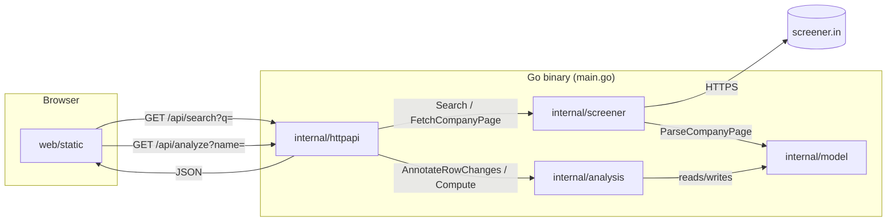

# Fundamental Analysis for Indian Stocks

A Go web app that looks up an Indian listed company by name, scrapes its **raw** financial statements from [screener.in](https://www.screener.in), and independently computes fundamental-analysis ratios and growth trends in Go — no pre-computed ratio from the source site is ever displayed as-is. Everything ships as a single compiled binary: the HTTP API and the static frontend are the same executable.

## Overview



- **`internal/model`** — the shared data shapes every other package passes around. No logic, just structs.
- **`internal/screener`** — the only package that talks to screener.in. Fetches raw HTML/JSON and parses it into `model` structs. Never computes a ratio.
- **`internal/analysis`** — the only package that does math. Takes the raw `model.CompanyData` and fills in `model.Analysis` (P/E, ROE, ROCE, growth trends, etc.) plus per-row `%` changes in every statement table.
- **`internal/httpapi`** — the HTTP layer. Wires a request into `screener` → `analysis` → JSON response.
- **`web/static`** — the frontend: plain HTML/CSS/JS, no build step, no framework. Embedded into the binary via `web/embed.go`.
- **`main.go`** — starts the HTTP server and connects the pieces above.

---

## Component-by-component

### `main.go`

The program's entry point.

- `func main()` — creates an `http.ServeMux` (a router), calls `httpapi.NewServer()` and `api.Routes(mux)` to register the API endpoints, registers `/static/` to serve embedded frontend files, registers `/` to serve `index.html`, then calls `http.ListenAndServe` to start accepting requests on port `8080`.

This file has no business logic — it only wires other packages together.

### `internal/model/model.go`

Defines every data shape used across the app. No functions, just `struct` types:

| Type | Purpose |
|---|---|
| `SearchResult` | one company search match (id, name, screener.in URL) |
| `DataRow` | one row of a statement table (label, values, and their `%` changes) |
| `FinancialTable` | a full table (Quarterly Results / P&L / Balance Sheet / Cash Flow / Shareholding) |
| `MarketFacts` | raw market data that can't be derived from statements (price, face value, 52W range) |
| `SeriesPoint` | one `(period, value)` sample in a computed trend |
| `GrowthMetric` | a full trend for one line item (series + CAGR + YoY) |
| `Analysis` | everything this app computes itself (ratios + growth metrics + notes) |
| `CompanyData` | the full `/api/analyze` response — bundles all of the above |

Every other package imports `model` and operates on these types; `model` itself imports nothing project-specific.

### `internal/screener` — fetching and parsing

**`client.go`** — HTTP access to screener.in, with caching and rate-limiting:

- `NewClient() *Client` — builds a client with a 15-minute in-memory cache.
- `(*Client) Search(query string)` — hits screener's `/api/company/search/?q=` JSON endpoint, returns `[]model.SearchResult`.
- `(*Client) FetchCompanyPage(relURL string)` — downloads a company page's raw HTML. Validates `relURL` against `companyURLPattern` first, so a caller-supplied URL can never make this server fetch an arbitrary host.
- `(*Client) get(fullURL string)` (private) — the shared logic behind both public methods: checks the cache, enforces a minimum gap between real requests (`minRequestGap`), sets a `User-Agent`, and stores the response back in the cache.

**`parse.go`** — turns raw HTML into `model.CompanyData`:

- `ParseCompanyPage(html []byte, sourceURL string) (*model.CompanyData, error)` — the entry point. Builds a `goquery` document and calls the helpers below to fill in each field.
- `parseMarketFacts(doc)` — reads only the handful of *raw* facts from the top-ratios box (current price, 52-week high/low, face value) — deliberately skips screener's own P/E, ROE, ROCE, etc.
- `parseFinancialTable(doc, sectionSelector, title)` — generic table reader, used once per statement (Quarterly, P&L, Balance Sheet, Cash Flow, Shareholding). Reads the `<thead>` for period labels/keys and every `<tbody>` row into a `model.DataRow`.
- `cleanText`, `cleanRowLabel`, `allNumbers`, `firstNumber` — small string/number cleanup helpers used by the two functions above.

`screener` never computes a ratio — it only extracts what's literally printed on the page.

### `internal/analysis/analysis.go` — the fundamental-analysis engine

This is where the actual "fundamental analysis" happens, entirely from the raw numbers `screener` handed back.

- `AnnotateRowChanges(table *model.FinancialTable)` — for **every** row in a table, fills `DataRow.ChangePercents` with the period-over-period `%` change (this is what powers the ▲/▼ under every value in every section). Called once per table.
- `Compute(data *model.CompanyData)` — the main entry point. Reads `data.ProfitLoss`, `data.BalanceSheet`, `data.CashFlow` and `data.Market`, and fills `data.Analysis` with:
  - Shares outstanding, Market Cap, EPS, P/E, Book Value/share (via `annualSeries` + `combine` + `last`)
  - ROE, ROCE, Debt/Equity — **skipped** for banks/NBFCs (detected by `hasRow(pl, "Financing Profit")`), since the standard formulas don't fit a deposit-funded business
  - Net Margin %, Depreciation %, OCF/Sales %, OCF/Net Profit %
  - Growth trends for Sales (or Revenue), Net Profit, EPS, Operating Margin, and Shares Outstanding — via `growthMetric`
  - Plain-English `Notes` — via `buildNotes`

Supporting (private) helpers, in the order `Compute` uses them:

- `annualSeries(table, label)` — pulls one labeled row out as a numeric `[]model.SeriesPoint`, skipping the TTM column.
- `findRow(table, label)` — case-insensitive row lookup by label.
- `combine(a, b, fn)` — merges two series matched by period (e.g. `Net Profit ÷ Net Worth`), skipping periods where either side is missing.
- `parseNumber(s)` — strips `₹`, `,`, `%`, `Cr.` and parses the underlying float.
- `last(series)` — the most recent value in a series.
- `growthMetric(label, unit, series, isFlow)` — builds a `model.GrowthMetric`: YoY change plus 3/5/10-year CAGR (`cagrOver`) for flow metrics, or just point-change YoY for margin metrics.
- `cagrOver(series, years)` / `pctChange(base, final)` — the actual growth-rate math.
- `hasRow(table, label)` — used once, to detect the bank/NBFC statement template.
- `buildNotes(a)` / `trimTrailingZeros(v)` — turn the computed numbers into short English sentences.

### `internal/httpapi/handlers.go` — the HTTP layer

Connects an incoming request to `screener` + `analysis` and writes JSON back.

- `NewServer() *Server` — builds a `Server` holding one `*screener.Client`.
- `(*Server) Routes(mux)` — registers `GET /api/search` → `handleSearch`, `GET /api/analyze` → `handleAnalyze`.
- `handleSearch(w, r)` — reads `?q=`, calls `s.screener.Search`, writes the results as JSON.
- `handleAnalyze(w, r)` — reads `?name=`, calls `s.analyzeByName(name)`, writes the result (or a `404`/`502` error) as JSON.
- `analyzeByName(name) (*model.CompanyData, error)` — the actual pipeline for one request:
  1. `s.screener.Search(name)` → pick the first match
  2. `s.screener.FetchCompanyPage(best.URL)` → raw HTML
  3. `screener.ParseCompanyPage(html, sourceURL)` → `*model.CompanyData`
  4. `analysis.AnnotateRowChanges(t)` for each of the 5 statement tables
  5. `analysis.Compute(data)` → fills `data.Analysis`
- `writeJSON` / `writeError` — small response-writing helpers.

### `web/embed.go` + `web/static/`

- `web/embed.go` — `//go:embed static` compiles every file under `static/` directly into the Go binary as `web.FS`, so the shipped executable needs no separate file deployment.
- `web/static/index.html` — page shell: a search box and empty result containers.
- `web/static/app.js` — all frontend logic (no framework). Key functions:
  - `fetchSuggestions` / `renderSuggestions` / `selectSuggestion` — the search-box autocomplete, backed by `/api/search`.
  - `runAnalysis(name)` — calls `/api/analyze?name=`, then hands the JSON to `render(data)`.
  - `render(data)` — builds the whole result view by calling `renderHeader`, `renderComputedFundamentals`, `renderGrowthAnalysis`, and `renderTable` (once per statement table).
  - `renderTable` / `dataCell` — generic table renderer; `dataCell` draws each value plus its ▲/▼ `%` change from `ChangePercents`.
  - `renderGrowthCard` / `sparklineSvg` — draws each growth-trend card and its inline SVG sparkline.
  - `withInfo(label)` + the `GLOSSARY` object + `openInfoPopoverFor`/`closeInfoPopover` — the click-triggered "i" info-button system explaining every jargon term.
- `web/static/style.css` — all styling (dark theme, responsive tables, the info popover, sparkline colors).

---

## Request lifecycle — a full walkthrough

What actually happens when you search "TCS":

1. **Browser** — you type in the search box; `app.js`'s `fetchSuggestions` debounces and calls `GET /api/search?q=TCS`.
2. **`main.go`**'s `mux` routes that to `httpapi.handleSearch`.
3. `handleSearch` calls `screener.Client.Search("TCS")`, which hits screener.in's own search API and returns matches as JSON — rendered by `renderSuggestions` as a dropdown.
4. You click "Tata Consultancy Services Ltd"; `selectSuggestion` calls `runAnalysis("Tata Consultancy Services Ltd")`, which calls `GET /api/analyze?name=...`.
5. `mux` routes that to `httpapi.handleAnalyze` → `analyzeByName`:
   - `screener.Client.Search` finds the best match again (its URL, e.g. `/company/TCS/consolidated/`).
   - `screener.Client.FetchCompanyPage` downloads that page's HTML (or serves it from cache if fetched in the last 15 minutes).
   - `screener.ParseCompanyPage` turns the HTML into a `*model.CompanyData` — `Name`, `About`, `Market`, and five `FinancialTable`s.
   - `analysis.AnnotateRowChanges` runs once per table, filling in every row's `%` change.
   - `analysis.Compute` fills `data.Analysis` — every ratio and growth trend, computed from those raw tables.
6. `handleAnalyze` writes `data` back as JSON.
7. **Browser** — `render(data)` builds the page: header + computed fundamentals + growth cards + the five statement tables, each row showing its value and ▲/▼ change, with "i" buttons wired to the glossary wherever a term needs explaining.

---

## Running it locally

```bash
go build -o sampleproject .
./sampleproject
# open http://localhost:8080
```

or, without a separate build step:

```bash
go run .
```

## API reference

| Endpoint | Query params | Returns |
|---|---|---|
| `GET /api/search` | `q` (company name, min 2 chars) | `[]model.SearchResult` |
| `GET /api/analyze` | `name` (company name) | `model.CompanyData` (statements + computed analysis) |

## Author-Syed Meezan Husain 

